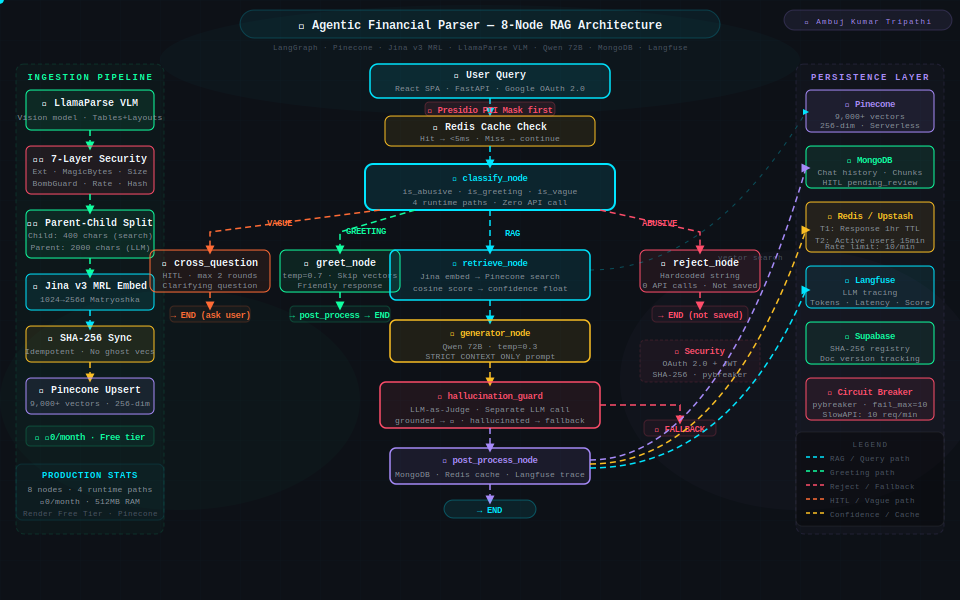

<div align="center">


[](https://github.com/Ambuj123-lab)

<br/>

[](https://www.linkedin.com/in/ambuj-tripathi-042b4a118/)
[](https://ambuj-portfolio-v2.netlify.app)
[](https://ambuj-rag-docs.netlify.app)
[](https://www.reddit.com/user/Lazy-Kangaroo-573/)
[](mailto:kumarambuj8@gmail.com)

</div>

---

## ⚡ Production at a Glance
<div align="center">

| 🧩 Chunks Indexed | 💰 Monthly Cost | ⚡ Retrieval | 🖥️ RAM Budget | 🌐 Reddit Reach | 🤖 Live Systems |
|:-:|:-:|:-:|:-:|:-:|:-:|
| **20,000+** | **₹0 / month** | **183 ms** | **512 MB** | **~128K+ impressions** | **3 Production** |

</div>

```
Three production AI systems. Zero cloud spend. Real users. Real queries.
Not a tutorial. Not a demo. Deployed, documented, and battle-tested.
```

---

## 🏅 Community Recognition

<div align="center">

**128K+ Views** · **16 Posts** · **Top 1% on r/LangChain** · **99th Percentile All-Time**

</div>

<br/>

| # | Post | Subreddit | Views | Engagement |
|:-:|---|:-:|:-:|:-:|
| 1 | LangGraph production RAG — Parent-Child retrieval | r/LangChain | **38K** | 99 ↑ |
| 2 | Agentic Financial Parser — 8-Node RAG playbook 🔥 | r/LangChain | **34K** | 93% ↑ · 440 shares |
| 3 | Legal AI on 512MB RAM — 51-page field guide | r/LangChain | **16K** | 46 ↑ |
| 4 | Production RAG 60-page playbook + Master Reference | r/Rag | **6.8K** | 22 ↑ |
| 5 | RAG on 512MB RAM: OOM Kills, Deadlocks & Fixes | r/LLMDevs | **2.5K** | 13 ↑ |

<br/>

<div align="center">

<a href="https://www.reddit.com/r/LangChain/comments/1s13mdm/i_built_an_8node_agentic_rag_with_langgraph_that/?utm_source=share&utm_medium=web3x&utm_name=web3xcss&utm_term=1&utm_content=share_button"></a>　<a href="https://www.reddit.com/r/LangChain/comments/1s13mdm/i_built_an_8node_agentic_rag_with_langgraph_that/?utm_source=share&utm_medium=web3x&utm_name=web3xcss&utm_term=1&utm_content=share_button"></a>

🥇 **Top 1% Poster** — r/LangChain · Within 1 month of joining
　🎨 **Picasso Badge** — 100+ upvotes on hand-coded SVG architecture diagrams

</div>

[](https://www.reddit.com/user/Lazy-Kangaroo-573/)


---

## 🚀 Production Systems

### 💰 Agentic Financial Parser `FLAGSHIP`
> `LangGraph` `Pinecone` `FastAPI` `Jina v3 MRL` `LlamaParse VLM` `Qwen 72B` `MongoDB` `Redis/Upstash` `Langfuse` `Presidio` `Supabase` `pybreaker`

```
📚  Knowledge Base   →  Budget 2024-25, Finance Bill, Tax Laws, RBI Guidelines, Constitution
🧩  Chunking         →  9,000+ vectors · Jina v3 MRL (1024→256d Matryoshka truncation)
📄  Document Parse   →  LlamaParse VLM — vision-language model for complex tables & layouts
🧠  Orchestration    →  8-Node LangGraph StateGraph · 4 runtime paths (RAG / Greeting / Vague / Abusive)
❓  HITL             →  CrossQuestioner node — 2-round clarification for vague queries
🛡️  LLM-as-Judge    →  Hallucination Guard — separate LLM call verifies grounding before response
🔒  Security         →  7-Layer Upload Pipeline + PII Shield (Presidio) + Circuit Breakers (pybreaker)
🔄  Sync Engine      →  SHA-256 idempotent upserts · Zero duplicate vectors · Zero ghost chunks
💰  Infrastructure   →  ₹0/month on Render free tier · 512MB RAM · Google OAuth
```

[](https://agentic-rag-financial-parser.onrender.com)
[](https://github.com/Ambuj123-lab/agentic-rag-financial-parser)
[](https://ambuj-rag-docs.netlify.app)

---

### ⚖️ Indian Legal AI Expert
> `LangGraph` `Qdrant` `FastAPI` `Jina AI` `Qwen 3 235B` `MongoDB` `Redis/Upstash` `Langfuse` `Presidio` `Supabase`

```
📚  Knowledge Base  →  6 Indian Legal Acts (IPC · BNS · BNSS · BSA · PCSO · IT Act)
🧩  Chunking        →  10,833 child vectors · Parent-Child (400-char search / 2000-char LLM context)
⚡  Performance     →  183ms retrieval · Sub-300ms end-to-end · SSE streaming responses
🛡️  Security        →  PII masking (Aadhaar / PAN / Mobile) before embedding · GDPR 30-day TTL
🔄  Sync Engine     →  SHA-256 idempotent upserts — zero duplicate vectors, zero ghost chunks
🧠  Orchestration   →  LangGraph 6-node state machine · 3 runtime paths (RAG / Greeting / Abusive)
🎯  Quality Gate    →  Confidence threshold at 40% cosine — zero hallucinated legal citations
💰  Infrastructure  →  ₹0/month on Render free tier · 99%+ uptime
```

[](https://indian-legal-ai-expert.onrender.com)

---

### 🛡️ Citizen Safety AI
> `LangGraph` `ChromaDB` `FastAPI` `OpenRouter` `SlowAPI` `React` `Vercel`

```
💬  Conversations   →  10,000+ real user conversations processed
🔢  Tokens          →  525,000+ tokens handled in production
🔒  Rate Limiting   →  SlowAPI — 5 req/min per IP (burst traffic protection)
⚡  Resilience      →  Circuit Breaker: fail_max=10, reset_timeout=120s (cascade failure prevention)
🐛  Production Fix  →  ChromaDB 0.6.x telemetry deadlock → pinned chromadb==0.4.24
💰  Infrastructure  →  ₹0/month on Vercel + Render free tier
```

[](https://citizen-safety-ai-assistant.vercel.app)

---

## 🛠️ Tech Stack
**Orchestration & Backend**


**Vector DB & Storage**


**LLMs & Embeddings**


**LLMOps & Security**


**Frontend & Deployment**


---

## 🏗️ System Architecture — Live Production Flow
> Hand-coded SVG · Animated flows · Production Data



<details>
<summary style="cursor: pointer;">
  
</summary>
<br/>

| Layer | Components |
|---|---|
| **Ingestion** | PDF Loader → LlamaParse VLM → 4-Layer OOM Shield → Parent-Child Chunker → Jina AI Embed → SHA-256 Sync → Pinecone/Qdrant Upsert |
| **Query Entry** | React → FastAPI → Google OAuth → Presidio PII Mask → Redis Cache Check |
| **LangGraph** | classify_node → 4 runtime paths (RAG / Greeting / Vague / Abusive) |
| **RAG Path** | retrieve_node → generate_node → Hallucination Guard → post_process_node |
| **HITL** | CrossQuestioner node → 2-round clarification for vague queries |
| **Persistence** | Pinecone · Qdrant · MongoDB · Redis/Upstash · Langfuse · Supabase · Circuit Breaker |

</details>

---

## 📚 Engineering Documentation
> Complete technical documentation of all production systems — architecture decisions, failure logs, chunking strategies, OOM prevention, LangGraph state machine deep-dives.

[](https://ambuj-rag-docs.netlify.app)

**Topics covered:** Document Loaders · LlamaParse VLM · Parent-Child Chunking · SHA-256 Sync Engine · LangGraph StateGraph · HITL CrossQuestioner · Hallucination Guard · OOM Prevention · Adaptive Retrieval · Deployment Failures & Fixes

---

## 💼 Professional Experience

### 🎨 AI Prompt Engineer — Hogarth Worldwide (WPP)
**Sep 2025 – Oct 2025 | Remote, India**
*(Contract — Concluded due to mandatory office relocation requirement)*

```
✓ 40% reduction in prompt iteration cycles for production LLM applications
✓ Built 25+ reusable prompt libraries across image and text generation models
✓ Systematic model validation, adversarial testing & QA pipelines
```
`Flux` `SDXL` `Prompt Engineering` `Model Validation` `Adversarial Testing`

---

### 🌐 Associate Engineer — British Telecom (BT)
**Jan 2022 – Aug 2024 | Gurugram, India**

```
✓ Led FTTP network planning (GIS, PipeR, Amanda toolchain)
✓ 98% QA compliance — "Top Performer" award
✓ Automation reduced manual effort by 70%
```

| Company | Role | Period | Impact |
|---|---|---|---|
| Tata Communications | O&M Engineer | Nov 2021 – Jan 2022 | 10% downtime reduction |
| TCS | System Admin | Oct 2013 – Nov 2014 | 99% uptime for revenue systems |
| Annu Infra | Fiber Engineer | Dec 2017 – Jun 2018 | Defense-grade fiber projects |

---

## 🏅 Certifications — 18+ Verified
| Provider | Areas |
|---|---|
| **NVIDIA** | RAG Agents with LlamaIndex · Building RAG Agents · Jetson Nano AI |
| **Google Cloud** | Gemini · Vertex AI · TensorFlow · Responsible AI |
| **IBM** | AI Fundamentals · Deep Learning · Generative AI |
| **Microsoft Azure** | Responsible AI · Azure AI Fundamentals |
| **Forage / Industry** | BCG · AWS · Deloitte · Tata simulations |

[](https://ambuj-portfolio-v2.netlify.app)

---

## 🎓 Education
| Degree | Institution | Year |
|---|---|---|
| PG Diploma — Power Transmission & Distribution | NPTI, Delhi | 2015–16 |
| B.Tech — Electrical & Electronics Engineering | UPTU, Lucknow | 2009–13 |

---

<div align="center">

## 📨 Open To
**GenAI Engineer · RAG Systems Architect · LLMOps · Agentic AI · Prompt Engineer**

> 🏠 Remote-first preferred · Open to Hybrid (Lucknow / NCR) · India

<br/>

[](https://www.linkedin.com/in/ambuj-tripathi-042b4a118/)
[](https://ambuj-portfolio-v2.netlify.app)
[](mailto:kumarambuj8@gmail.com)
[](https://www.reddit.com/user/Lazy-Kangaroo-573/)

<br/>

<a href="https://ambuj-portfolio-v2.netlify.app"></a>

---

*Three production systems. Zero budget. Real users. All documented.*

**© 2026 Ambuj Kumar Tripathi — All projects and certifications verifiable**

</div>
