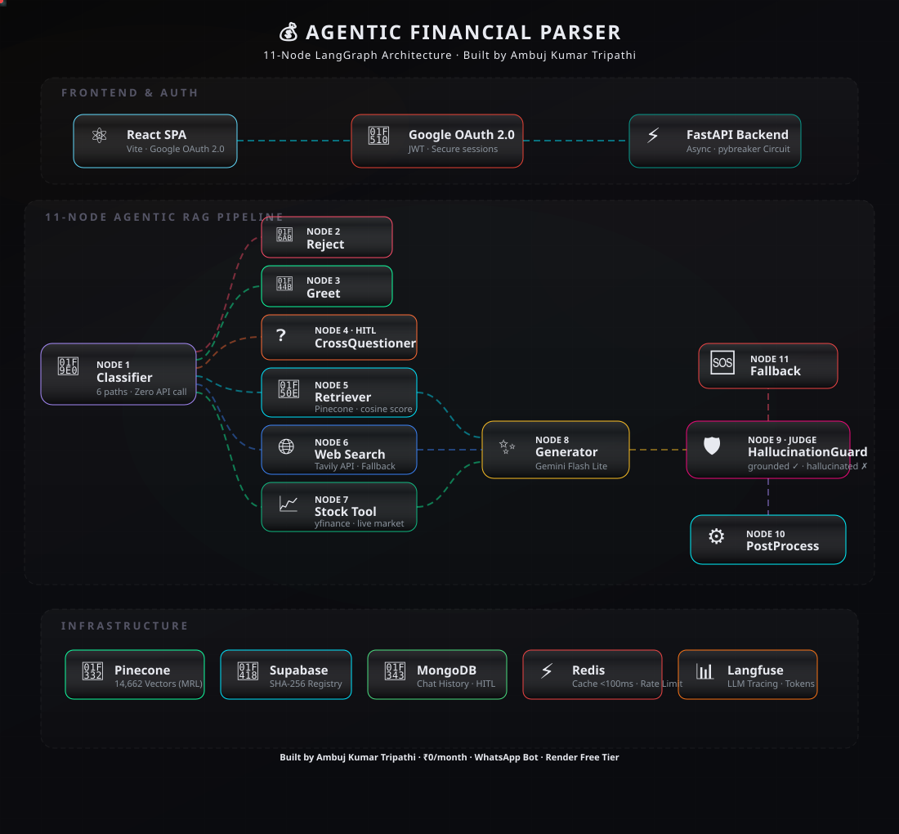

<div align="center">


[;11-Node+Agentic+RAG+%C2%B7+100%2B+Stars+%C2%B7+LangGraph;UptimeRobot+Global+Spotlight+%C2%B7+M8ven+Verified+Publisher;32%2C000%2B+Vectors+%C2%B7+Fine-Tuned+LLMs+(QLoRA);Zero-Cloud-Cost+AI+Infrastructure+%C2%B7+99.98%25+Uptime)](https://github.com/Ambuj123-lab)

<br/>

[](https://uptimerobot.com/blog/community-spotlight-ambuj-kumar-tripathi/)
[-6366F1?style=for-the-badge&logo=shield&logoColor=white)](https://career-workspace-ambujsystems.vercel.app)
[](https://github.com/Ambuj123-lab/agentic-rag-financial-parser)
[](https://medium.com/@ambuj_tripathi/i-built-an-11-node-agentic-rag-system-that-handles-indias-most-complex-government-pdfs-here-s-cd37607b02ff)

<br/>

[](https://www.linkedin.com/in/ambuj-tripathi-042b4a118/)
[](https://ambuj-ai-portfolio.vercel.app)
[](https://ambuj-rag-docs.netlify.app)
[](https://huggingface.co/Ambuj123-lab)
[](mailto:kumarambuj8@gmail.com)

</div>

---

## ⚡ Production at a Glance
<div align="center">

| 🧩 Vectors & Chunks | 💰 Monthly Cost | ⚡ Retrieval | 🛡️ MCP Trust Score | 🌟 Open Source Reach | 🤖 Live Platforms |
|:-:|:-:|:-:|:-:|:-:|:-:|
| **32,000+** | **₹0 / month** | **183 ms** | **89/100 (M8ven)** | **100+ Stars · 29+ Forks** | **4 Live Platforms** |

</div>

```
Four production AI platforms. Zero cloud spend. Real users. Real queries.
FastMCP tools, Agentic RAG, and fine-tuned LLMs. Deployed, documented, and battle-tested.
```

---

## 🏆 Industry Recognition & Engineering Case Studies

<div align="center">

**Official Global Spotlight** · **M8ven Verified MCP Publisher** · **100+ GitHub Stars** · **Published Technical Dossiers**

</div>

<br/>

| # | Technical Case Study / Publication | Platform | Focus Area | Impact & Validation |
|:-:|---|:-:|:-:|:-:|
| 1 | **High-Reliability Agentic RAG on 512MB RAM** | [UptimeRobot Official Spotlight](https://uptimerobot.com/blog/community-spotlight-ambuj-kumar-tripathi/) | Zero-Cost Infrastructure & Container Recovery | **Official Global Feature (99.98% Uptime)** |
| 2 | **11-Node Production Agentic RAG Playbook** | [Medium Publication](https://medium.com/@ambuj_tripathi/i-built-an-11-node-agentic-rag-system-that-handles-indias-most-complex-government-pdfs-here-s-cd37607b02ff) | LlamaParse VLM, Matryoshka MRL & FastMCP | **Published Engineering Breakdown** |
| 3 | **Autonomous Financial Parser (Show HN)** | [Hacker News / GitHub](https://github.com/Ambuj123-lab/agentic-rag-financial-parser) | Production Multi-Agent Retrieval | **100+ Stars · 29+ Forks** |
| 4 | **Evidence-Grounded Career Workspace** | [M8ven MCP Trust Index](https://career-workspace-ambujsystems.vercel.app) | JSON-RPC Tool Calling & Schema Security | **89/100 Security & Schema Audit** |
| 5 | **Production RAG Constitution & Field Guide** | [Engineering Docs](https://ambuj-rag-docs.netlify.app) | 4-Layer OOM Shield, Parent-Child Sync | **Full Technical Dossier** |

<br/>

<div align="center">

### 🏆 Featured by UptimeRobot (Official Global Spotlight)
> **Selected & Interviewed by UptimeRobot** for architecting high-reliability Agentic RAG systems (99.98% uptime) and solving container sleep + database pauses on zero-cost 512MB RAM infrastructure.
> 
> 🔗 **Read the full published case study:** [**UptimeRobot Blog — Community Spotlight: Ambuj Kumar Tripathi →**](https://uptimerobot.com/blog/community-spotlight-ambuj-kumar-tripathi/)
> 
> ✍️ **Check out the detailed engineering breakdown:** [**Medium — Building an 11-Node Production RAG System →**](https://medium.com/@ambuj_tripathi/i-built-an-11-node-agentic-rag-system-that-handles-indias-most-complex-government-pdfs-here-s-cd37607b02ff)

### 🛡️ Verified FastMCP Publisher & Open Source Reach
> **M8ven MCP Trust Index:** Audited and verified publisher with **89/100 security & schema trust score** on the public MCP registry.
> **Open-Source Community Reach:** **100+ GitHub Stars and 29+ forks** driven by Show HN community launch for the Agentic RAG platform.

</div>

---

## 🚀 Production Systems

### 🎯 CoverCraft AI — Career Workspace & FastMCP Claim Engine `NEW FLAGSHIP`
> `Next.js 16` `FastMCP` `Gemini AI` `Langfuse` `LangSmith` `MongoDB` `Google OAuth` `Recharts` `TailwindCSS`

```
🔍  Core Engine     →  Evidence-Grounded Resume Claim Validation & Interview Defense Simulator
⚡  FastMCP Tools   →  JSON-RPC FastMCP Server with Live Jina Reader & Tavily Company Web Research
📊  Scoring Radar   →  5-Axis Competency Fit (Technical, Domain, Seniority, Tools, Culture)
🛡️  MCP Audit Gate  →  Verified Publisher on M8ven Trust Index (89/100 Security & Schema Audit Score)
🧠  LLMOps Tracking →  Dual Langfuse & LangSmith Tracing for Token Costs, Latency & Failure Diagnostics
🔒  Authentication  →  NextAuth Google OAuth 2.0 with MongoDB 30-Day TTL Session Persistence
💰  Infrastructure  →  Live Production on Vercel · Server-Sent Events (SSE) · Zero Cold-Start
```

[](https://career-workspace-ambujsystems.vercel.app)
[](https://github.com/Ambuj123-lab/career-workspace-ambujsystems)
[](https://career-workspace-ambujsystems.vercel.app/docs)

---

### 💰 Agentic Financial Parser `FLAGSHIP`
> `LangGraph` `Pinecone` `FastAPI` `Jina v3 MRL` `LlamaParse VLM` `Cohere Reranker` `Gemini 3.5 Flash Lite` `MongoDB` `Redis/Upstash` `Langfuse` `Presidio` `Supabase` `pybreaker`

```
📚  Knowledge Base   →  Budget 2024-25, Finance Bill, Tax Laws, RBI Guidelines, Constitution
🧩  Vector Scale     →  14,662 vectors · 100+ GitHub Stars & 29+ Forks · Jina v3 MRL (1024→256d)
📄  Document Parse   →  LlamaParse VLM — vision-language model for complex tables & layouts
🧠  Orchestration    →  11-Node LangGraph StateGraph · Classifier (6-path) · Parallel Retrieval
❓  Tools & HITL     →  Web Search + Stock Tool (Gemini) · HITL clarification & permission
🛡️  LLM-as-Judge    →  Hallucination Guard — separate LLM call verifies grounding before response
🔒  Security         →  7-Layer Upload Pipeline + PII Shield (regex) + Circuit Breakers (pybreaker)
🔄  Sync Engine      →  SHA-256 idempotent upserts · Zero duplicate vectors · Zero ghost chunks
💰  Infrastructure   →  ₹0/month on Render free tier · WhatsApp Bot · Daily AI Newsletter
```

[](https://agentic-rag-financial-parser.onrender.com)
[](https://github.com/Ambuj123-lab/agentic-rag-financial-parser)
[](https://ambuj-rag-docs.netlify.app)

---

### ⚖️ Indian Legal AI Expert
> `LangGraph` `Qdrant` `FastAPI` `Jina AI` `Qwen 3 235B` `MongoDB` `Redis/Upstash` `Langfuse` `Presidio` `Supabase`

```
📚  Knowledge Base  →  6 Indian Legal Acts (IPC · BNS · BNSS · BSA · PCSO · IT Act)
🧩  Chunking        →  10,833 child vectors · Parent-Child (400-char search / 2000-char LLM context)
⚡  Performance     →  183ms retrieval · Sub-300ms end-to-end · SSE streaming responses
🛡️  Security        →  PII masking (Aadhaar / PAN / Mobile) before embedding · GDPR 30-day TTL
🔄  Sync Engine     →  SHA-256 idempotent upserts — zero duplicate vectors, zero ghost chunks
🧠  Orchestration   →  LangGraph 6-node state machine · 3 runtime paths (RAG / Greeting / Abusive)
🎯  Quality Gate    →  Confidence threshold at 40% cosine — zero hallucinated legal citations
💰  Infrastructure  →  ₹0/month on Render free tier · 99%+ uptime
```

[](https://indian-legal-ai-expert.onrender.com)

---

### 🛡️ Citizen Safety AI
> `LangGraph` `ChromaDB` `FastAPI` `OpenRouter` `SlowAPI` `React` `Vercel`

```
💬  Conversations   →  10,000+ real user conversations processed
🔢  Tokens          →  525,000+ tokens handled in production
🔒  Rate Limiting   →  SlowAPI — 5 req/min per IP (burst traffic protection)
⚡  Resilience      →  Circuit Breaker: fail_max=10, reset_timeout=120s (cascade failure prevention)
🐛  Production Fix  →  ChromaDB 0.6.x telemetry deadlock → pinned chromadb==0.4.24
💰  Infrastructure  →  ₹0/month on Vercel + Render free tier
```

[](https://citizen-safety-ai-assistant.vercel.app)

---

## 🛠️ Tech Stack
**Orchestration & Backend**


**Vector DB & Storage**


**LLMs & Embeddings**


**LLMOps & Security**


**Frontend & Deployment**


---

## 🏗️ System Architecture — Live Production Flow
> Hand-coded SVG · Animated flows · Production Data



<details>
<summary><b><kbd>&nbsp;📐 Architecture Breakdown — Click to expand ▾&nbsp;</kbd></b></summary>
<br/>

| Layer | Components |
|---|---|
| **Ingestion** | PDF Loader → LlamaParse VLM → 4-Layer OOM Shield → Parent-Child Chunker → Jina AI Embed → SHA-256 Sync → Pinecone/Qdrant Upsert |
| **Query Entry** | React → FastAPI → Google OAuth → Presidio PII Mask → Redis Cache Check |
| **LangGraph** | classify_node → 4 runtime paths (RAG / Greeting / Vague / Abusive) |
| **RAG Path** | retrieve_node → generate_node → Hallucination Guard → post_process_node |
| **HITL** | CrossQuestioner node → 2-round clarification for vague queries |
| **Persistence** | Pinecone · Qdrant · MongoDB · Redis/Upstash · Langfuse · Supabase · Circuit Breaker |

</details>

---

## 📚 Engineering Documentation
> Complete technical documentation of all production systems — architecture decisions, failure logs, chunking strategies, OOM prevention, LangGraph state machine deep-dives.

[](https://ambuj-rag-docs.netlify.app)

**Topics covered:** Document Loaders · LlamaParse VLM · Parent-Child Chunking · SHA-256 Sync Engine · LangGraph StateGraph · HITL CrossQuestioner · Hallucination Guard · OOM Prevention · Adaptive Retrieval · Deployment Failures & Fixes

---

## 💼 Professional Experience

### 🎨 AI Prompt Engineer — Hogarth Worldwide (WPP)
**Sep 2025 – Oct 2025 | Remote, India**
*(Contract — Concluded due to mandatory office relocation requirement)*

```
✓ 40% reduction in prompt iteration cycles for production LLM applications
✓ Built 25+ reusable prompt libraries across image and text generation models
✓ Systematic model validation, adversarial testing & QA pipelines
```
`Flux` `SDXL` `Prompt Engineering` `Model Validation` `Adversarial Testing`

---

### 🌐 Associate Engineer — British Telecom (BT)
**Jan 2022 – Aug 2024 | Gurugram, India**

```
✓ Led FTTP network planning (GIS, PipeR, Amanda toolchain)
✓ 98% QA compliance — "Top Performer" award
✓ Automation reduced manual effort by 70%
```

| Company | Role | Period | Impact |
|---|---|---|---|
| Tata Communications | O&M Engineer | Nov 2021 – Jan 2022 | 10% downtime reduction |
| TCS | System Admin | Oct 2013 – Nov 2014 | 99% uptime for revenue systems |
| Annu Infra | Fiber Engineer | Dec 2017 – Jun 2018 | Defense-grade fiber projects |

---

## 🏅 Certifications — 18+ Verified
| Provider | Areas |
|---|---|
| **NVIDIA** | RAG Agents with LlamaIndex · Building RAG Agents · Jetson Nano AI |
| **Google Cloud** | Gemini · Vertex AI · TensorFlow · Responsible AI |
| **IBM** | AI Fundamentals · Deep Learning · Generative AI |
| **Microsoft Azure** | Responsible AI · Azure AI Fundamentals |
| **Forage / Industry** | BCG · AWS · Deloitte · Tata simulations |

[](https://ambuj-ai-portfolio.vercel.app)

---

## 🎓 Education
| Degree | Institution | Year |
|---|---|---|
| PG Diploma — Power Transmission & Distribution | NPTI, Delhi | 2015–16 |
| B.Tech — Electrical & Electronics Engineering | UPTU, Lucknow | 2009–13 |

---

<div align="center">

## 📨 Open To
**GenAI Engineer · RAG Systems Architect · LLMOps · Agentic AI · Prompt Engineer**

> 🏠 Remote-first preferred · Open to Hybrid (Lucknow / NCR) · India

<br/>

[](https://www.linkedin.com/in/ambuj-tripathi-042b4a118/)
[](https://ambuj-ai-portfolio.vercel.app)
[](mailto:kumarambuj8@gmail.com)

<br/>

<a href="https://ambuj-ai-portfolio.vercel.app"></a>

---

*Four production AI platforms. Zero budget. Real users. FastMCP & Agentic RAG.*

**© 2026 Ambuj Kumar Tripathi — All projects and certifications verifiable**

</div>
